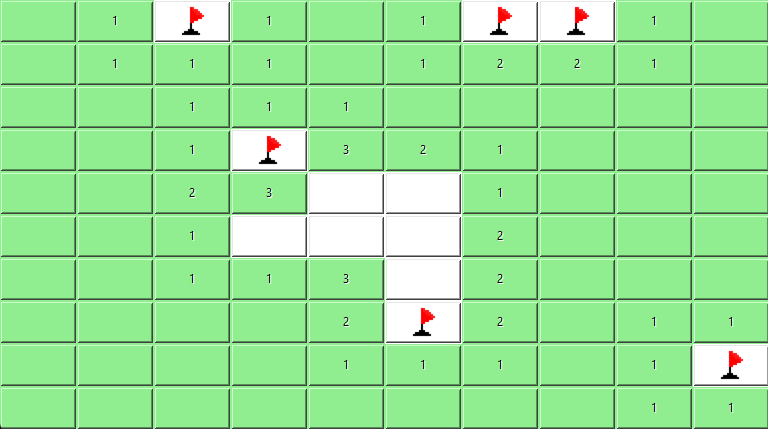

# minesweeper

A minesweeper clone made in Python using the Tkinter library.

## Installation

Create a virtual environment, install dependencies, and run the code. For example, for Mac OS:
````
python3 -m venv venv
source venv/bin/activate
pip install -r requirements.txt
python3 main.py
````

## Gameplay

<p align="center">
  
</p>